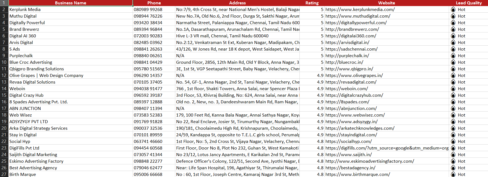
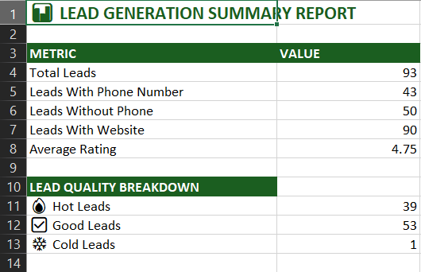

# 🧹 Lead Data Cleaning Pipeline

Automatically cleans and enriches raw business lead data
from Google Maps into a professional Excel report.

## 💼 What Problem This Solves
Raw scraped data is messy — duplicate entries, 
inconsistent phone formats, missing values everywhere.
This pipeline cleans everything automatically in seconds.

## ⚙️ What It Does Step By Step
- Step 1 → Removes empty rows
- Step 2 → Removes duplicate businesses
- Step 3 → Formats phone numbers (+91 format)
- Step 4 → Cleans and standardizes ratings
- Step 5 → Fills missing values
- Step 6 → Sorts by rating (highest first)
- Step 7 → Adds Lead Quality Score (Hot/Good/Cold)

## 📊 Output — 3 Excel Sheets
Input:
    "Raw leads Excel from Google Maps scraper"
### All Cleaned Leads

### 🔥 Hot Leads Only

### 📊 Summary Sheet

## 📈 Sample Results
- Total leads cleaned: 93
- Hot leads identified: 39
- Average rating: 4.75
- Phone numbers formatted: 43

## 🛠️ Tools Used
- Python
- Pandas
- OpenPyXL

## 📦 Installation
pip install -r requirements.txt

## ▶️ How To Run
python lead_cleaner.py

## 👤 Author
**Keshava Murthy P**
Python Developer | Data Automation & Web Scraping Specialist

